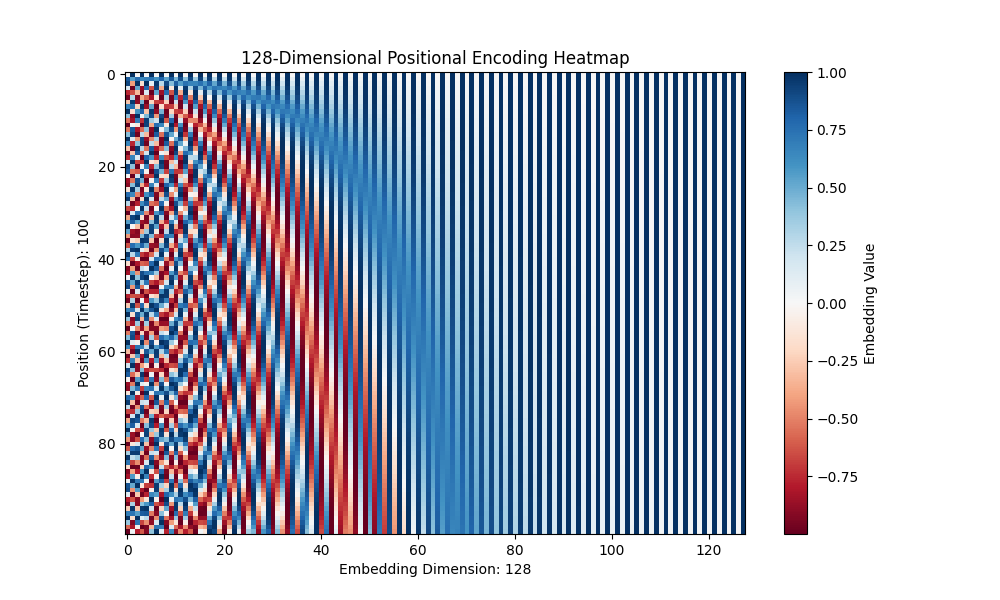
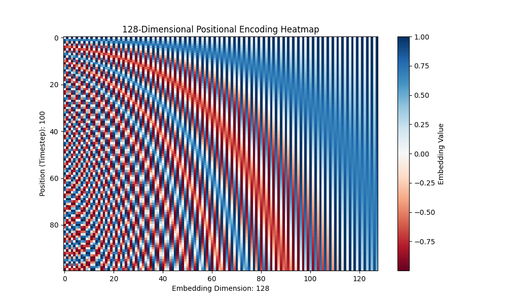

# Model architecture

<br></br>

## Transformer sinusoidal position embedding

In the diffusion model, noise is added in the forward process and removed in the reverse process as time passes. Therefore, timestep information is important and must be incorporated into the network.

So **how can we embed time information into the network?** A simple way would be to add timestep $T$ to the input feature like $[inputFeature, timestepT]$. [I have implemented a simple diffusion model using this method.](https://medium.com/@hirok4/implementation-of-diffusion-model-51788594d794)

However, there are drawbacks to this method. If the timestep is different during training and inference, it loses its generalization. For example, if a model is trained with a timestep $50$, it will be difficult to maintain the accuracy of the model if the timestep is $10000$ during inference.

So **how about normalizing the range of timestep?** For example, if we set the range to $0\sim 1$, all timesteps will fall within the range $0\sim 1$. However, this will not maintain a consistent meaning per timestep if the total number of timesteps is different.

Ideally, the relationship between different timesteps should be preserved and a consistent meaning per timestep should also be preserved. Also, each timestep should be a unique representation.

The [Diffusion model paper](https://arxiv.org/pdf/2006.11239) uses **Transformer sinusoidal position embedding** to preserve timestep.
Transformer sinusoidal position embedding is a method that can solve the above issues proposed in the [Attention paper](https://arxiv.org/pdf/1706.03762).

```
Parameters are shared across time, which is specified to the network using the Transformer sinusoidal position embedding.
```

The equation of PE(positional encoding) is as follows.

$$
\begin{align*}
PE(pos, 2i) &= sin(pos/10000^{2i/d_{model}}) \\
PE(pos, 2i+1) &= cos(pos/10000^{2i/d_{model}})
\end{align*}
$$

$pos$ is the position and $i$ is the dimension. An example implementation in python is shown below.

```python
class SinusoidalPositionalEmbedding(nn.Module):
    def __init__(self, embedding_dim):
        super().__init__()
        self.embedding_dim = embedding_dim

    def forward(self, timesteps):
        positions = np.arange(timesteps)[:, np.newaxis]  # Shape: (timesteps, 1)
        dimensions = np.arange(self.embedding_dim)[
            np.newaxis, :
        ]  # Shape: (1, embedding_dim)

        # Compute angles using sine for even indices and cosine for odd indices
        angle_rates = 1 / np.power(10000, (2 * (dimensions // 2)) / self.embedding_dim)
        angle_rads = positions * angle_rates

        pos_encoding = np.zeros_like(angle_rads)
        pos_encoding[:, 0::2] = np.sin(angle_rads[:, 0::2])
        pos_encoding[:, 1::2] = np.cos(angle_rads[:, 1::2])
        return pos_encoding
```

You can try PE by running the following command.

```bash
python3 positional_embedding.py
```



It can be seen that by using $sin$ and $cos$, the continuity information can be maintained between successive timesteps. This allows the model to easily learn continuity information.

Furthermore, since consistent information can be maintained even if the timestep is changed, the model can cope well even if timestep information that was not available at the time of training appears at the time of inference.

The gif below shows PE when timestep is changed from $100$ to $500$. You can see that consistent position information is maintained.


Finally, **why does PE use the number $10000$ in trigonometric functions?**  
It is not detailed in the paper, but perhaps $10000$ was just the right number, although other numbers could have been used.  

The image below is the one I took when I changed the value from $10000$ to $100$ as a test. You can see that wavelength has become longer.



<br></br>

## References
- [Transformer Architecture: The Positional Encoding](https://kazemnejad.com/blog/transformer_architecture_positional_encoding/)
- [Attention Is All You Need](https://arxiv.org/pdf/1706.03762)
- [Denoising Diffusion Probabilistic Models](https://arxiv.org/pdf/2006.11239)
